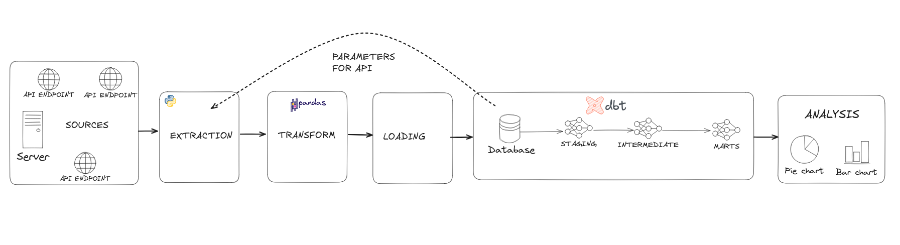
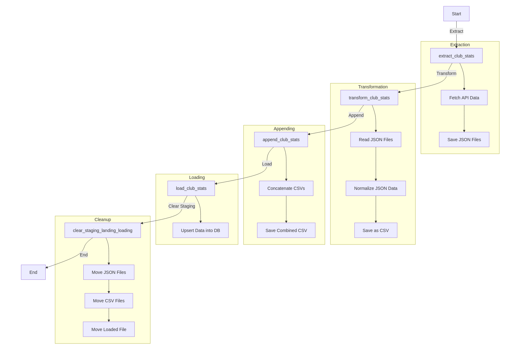
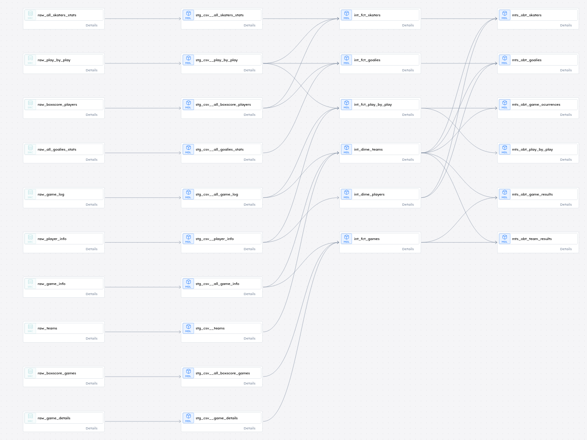

# Building a Data Warehouse with NHL Data

### Motivation
I dedicated one month of my free time to building a Data Warehouse using NHL API data, and it was an exciting challenge. Sports data is among the most comprehensive, dynamic, and relatively complex, requiring meticulous work in collection, modeling, optimization, and versioning of pipelines and data models—exactly what’s expected in the corporate world. The central idea was to transform raw NHL data into an organized and efficient model for various analyses running locally, and the timing was perfect with the league's break for the World Cup tournament over the next two weeks.
Challenges

Throughout the project, I had to deal with several fundamental issues to ensure that the DW was scalable, efficient, and reliable:

- **Data Collection:** The NHL API offers dozens of endpoints, but not all were relevant. An analytical approach was required to filter what truly mattered while dealing with limited documentation.

- **Data Modeling:** Proper data structuring is essential to avoid redundancy and ensure consistency. Using dbt proved crucial for documenting and maintaining well-organized models, along with the use of surrogate keys.

- **Load Optimization:** The first data load is always the heaviest, and using commands like COPY instead of INSERT made a significant difference in execution time.

- **Performance and Parallelism:** Extracting and processing large volumes of data can be time-consuming without parallelism techniques.

- **Data Integrity Management:** Ensuring data consistency, avoiding duplicates, and properly synchronizing tables loaded on different days was a critical challenge, as new games were played, and more data and statistics needed to be updated and reconciled.

This project was an excellent exercise in data engineering and reaffirmed the importance of thinking beyond analysis: optimizing load times, ensuring data reliability, and ensuring system scalability are key aspects.

## Project Overview

### Pipeline Design

### dbt Data Models

### Next Steps
- Orchestration with Airflow: Implementing orchestration for data pipelines using Airflow to automate the entire ETL process.

- Refactor with Cloud: Refactoring the system to leverage cloud technologies for better scalability, flexibility, and cost efficiency.

- More Unit Testing: Performing additional unit testing to ensure the reliability and robustness of the system.

- Use Spark for Historical Data Processing: Integrating Spark to handle the processing of large volumes of historical data, improving speed and efficiency.
