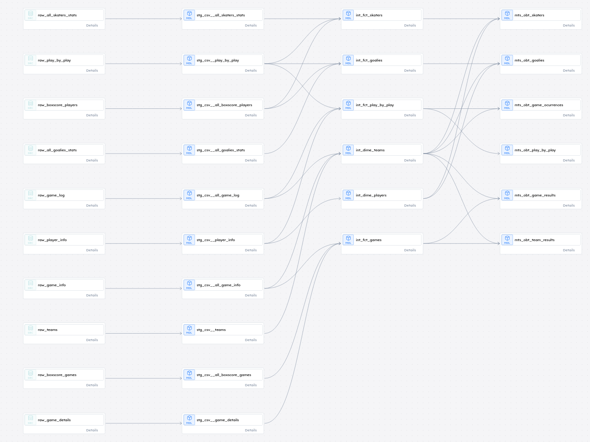

# Construindo um Data Warehouse com Dados da NHL
### Motivação
Dediquei 1 mês de horas livres para construir um Data Warehouse com dados de API's da NHL e foi um desafio empolgante. Os dados esportivos estão entre os mais completos, dinâmicos e relativamente complexos, o que exigiu um trabalho minucioso de coleta, modelagem, otimização e versionamento dos pipelines e modelos de dados, nada menos que o esperado na realidade corporativa.
A ideia central era transformar dados brutos da NHL em um modelo organizado e eficiente para diversas análises rodando localmente, e o momento foi oportuno com a pausa na liga para o torneio mundial nas próximas 2 semanas.

### Desafios
Ao longo do projeto, tive que lidar com diversas questões fundamentais para garantir que o DW fosse escalável, eficiente e confiável:

- **Coleta de dados:** A API da NHL oferece dezenas de endpoints, mas nem todos eram relevantes. Foi necessário um trabalho analítico para filtrar o que realmente importava e lidar com uma documentação limitada;

- **Modelagem de dados:** A estruturação correta dos dados é essencial para evitar redundância e garantir consistência. O uso do dbt se mostrou crucial para documentar e manter os modelos bem organizados bem como uso de surrogate keys;

- **Otimização de carga:** A primeira carga de dados é sempre mais volumosa, e utilizar comandos como COPY ao invés de INSERT fez uma grande  diferença no tempo de execução.

- **Performance e paralelismo:** A extração e o processamento de grandes volumes de dados podem ser demorados sem técnicas de paralelismo;

- **Gestão da integridade dos dados:** Garantir que os dados estavam consistentes, sem duplicidades e corretamente sincronizados entre tabelas carregadas em dias diferentes foi um desafio crítico, já que novos jogos foram acontecendo e mais dados e estatísticas precisam ser atualizadas e equalizadas;

Esse projeto foi um excelente exercício de engenharia de dados e reafirmou a importância de pensar além da análise: a otimização da carga, a confiabilidade dos dados e a escalabilidade do sistema são aspectos fundamentais.

### Pipeline Design

### Modelagem

### Próximos passos
A orquestração via Airflow

Refactor com uso de Cloud;

Realizar mais testes unitários;

Utilizar Spark para o processamento de dados históricos;
